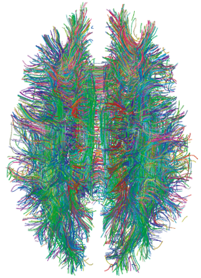
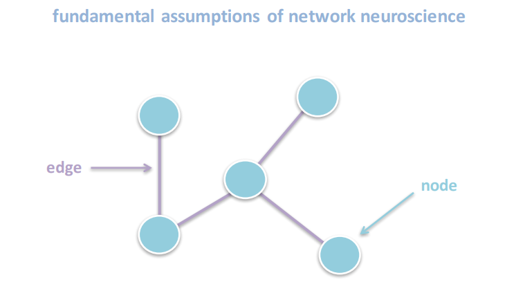

# Introduction to C. Elegans

> Caenorhabditis elegans (AKA C. Elegans, AKA Roundworm)  a free-living transparent nematode about 1 mm in length that lives in temperate soil environments. They lack respiratory or circulatory systems. Most of these nematodes are hermaphrodites and a few are males. Males have specialised tails for mating that include spicules.

> In 1963, Sydney Brenner proposed research into C. elegans, primarily in the area of neuronal development. In 1974, he began research into the molecular and developmental biology of C. elegans, which has since been extensively used as a model organism. It was the first multicellular organism to have its whole genome sequenced, and in 2019 it was the first organism to have its connectome (neuronal "wiring diagram") completed. As of 2024, four Nobel prizes have been won for work done on C. elegans.

> C. elegans was the first multicellular organism to have its whole genome sequenced.


## Why are they special?

> Brenner also chose it as it is easy to grow in bulk populations, and convenient for genetic analysis. It is a multicellular eukaryotic organism, yet simple enough to be studied in great detail. The transparency of C. elegans facilitates the study of cellular differentiation and other developmental processes in the intact organism. The spicules in the male clearly distinguish males from females.

> Nicotine dependence can also be studied using C. elegans because it exhibits behavioral responses to nicotine that parallel those of mammals. These responses include acute response, tolerance, withdrawal, and sensitization.

> C. elegans has been a model organism for research into ageing; for example, the inhibition of an insulin-like growth factor signaling pathway has been shown to increase adult lifespan threefold; while glucose feeding promotes oxidative stress and reduces adult lifespan by a half.


## Some fun facts about these little guys

> C. elegans is notable in animal sleep studies as the most primitive organism to display sleep-like states. C. elegans has also been demonstrated to sleep after exposure to physical stress, including heat shock, UV radiation, and bacterial toxins.

> While the worm has no eyes, it has been found to be sensitive to light due to a third type of light-sensitive animal photoreceptor protein, LITE-1, which is 10 to 100 times more efficient at absorbing light than the other two types of photopigments (opsins and cryptochromes) found in the animal kingdom. 

> C. elegans is remarkably adept at tolerating acceleration. It can withstand 400,000 g's, according to geneticists at the University of São Paulo in Brazil. In an experiment, 96% of them were still alive without adverse effects after an hour in an ultracentrifuge.

> C. elegans made news when specimens were discovered to have survived the Space Shuttle Columbia disaster in February 2003. Later, in January 2009, live samples of C. elegans from the University of Nottingham (THAT'S MY UNI!) were announced to be spending two weeks on the International Space Station that October, in a space research project to explore the effects of zero gravity on muscle development and physiology. The research was primarily about genetic basis of muscle atrophy, which relates to spaceflight or being bed-ridden, geriatric, or diabetic. It was shown that the genes affecting muscles attachment were expressed less in space. However, it has yet to be seen if this affects muscle strength.

> Parents will then proceed to exhibit food-leaving behavior for the benefit of their offspring when food sources become limited. Since this behavior depends on nematocin, an ancient nematode version of oxytocin (colloquially referred to as the "love hormone"), researchers have recognized C. elegans as evidence of 'caring' behavior in nematodes.

[Source - Wikipedia](https://en.wikipedia.org/wiki/Caenorhabditis_elegans)

# Terminology
- Connectome: the comprehensive map of neural connections in the brain or the complete wiring diagram of an organism's nervous system: which neurons connect to which, and how strongly. Like a biological graph/network.



[Picture Source - Wikipedia](https://en.wikipedia.org/wiki/Connectome)


## Graph theory:
[Source for info & images - Alex Fornito](https://www.humanbrainmapping.org/files/2016/ED/Fornito_OHBM-June_2016.pdf)



- Any network (`Connectomes` are networks) can be modelled as a graph of nodes connected by edges.
- `Nodes` represent fundamental processing units. = Neurons
- `Edges` represent the interactions between nodes. = Synaptic connections
- `Edge weight` = "Number of Connections" (synapse count between a pair)
- `Directed graph` is a set of nodes (vertices) connected by edges that have a specific direction. = Connections go from Neuron -> Target, not necessarily both ways.


## Neurotransmitter type (exc/inh)
- A `neurotransmitter` is a chemical messenger that nerve cells use to send signals to other cells, like other nerves, muscles, or glands.
- `exc` = `excitatory` - makes the target neuron more likely to fire
- `inh` = `inhibitory` - makes the target neuron less likely to fire
- This is essentially an edge label/sign, similar to signed graphs in ML (like `+` and `-` on the edges)

## 4 layers in this project

1. `Connectome.csv` - neuron-to-neuron synapses (the "brain" wiring)
2. `Neurons_to_Muscles.csv` - how neural signals turn into physical movement (motor output)
3. `Sensory.csv` - sensory neurons, their modality (mechanosensory, chemosensory, thermosensory, etc.) and which neurotransmitter they release
4. `Distances.csv` - the 3D coordinates (x, y, z, in micrometers) for each neuron's cell body, giving its physical location within the worm. `x = left/right`, `y = anterior/posterior (head-to-tail)`, `z = dorsal/ventral`. 

### The relationship between the layers - Visualised
- **Layers 1–3 describe the topology** - the map of "who is connected to whom, how strongly, and with what sign (excitatory/inhibitory). This is pure graph and it doesn't actually say anything about the physical space (such as where the neurons are or whether they're neighbours).
- **Layer 4 describes the geometry** - where each neuron actually sits inside the worm's body. Combined with the connectivity data, this allows computing the physical (Euclidean) distance spanned by any synaptic connection.

```
Sensory.csv          →  labels which neurons are the "input layer" (touch, smell, temperature, etc.)
        ↓
Connectome.csv        →  the wiring that carries signals from sensory neurons through
                          interneurons, toward motor neurons
        ↓
Neurons_to_Muscles.csv →  the wiring that converts neural signal into
                          physical movement ("output layer")

Distances.csv           (layered on top of all of the above)
                         →  tells the physical location of every node involved in that entire pipeline
```

## Use Cases / iDEAS

###  A full "digital worm" input-to-output map
- Using Sensory + Connectome + Neurons_to_Muscles together, a complete path can be traced:
- "if the worm's nose touches something, which sensory neuron fires, what chain of interneurons does that signal pass through, and which muscle ultimately contracts?" 

### A better embedding / classification (Distances + Connectome + Sensory together)
- "Average distance to its connected neurons" or "distance to nearest sensory neuron" can be added as extra features. This often improves prediction and gives you an interesting hypothesis to answer ("does adding spatial info improve the model? by how much?").

### A physically accurate visualization (Distances used purely for layout)
- With Distances.csv the graph can be laid out using the worm's real geometry. The network diagram would visually resemble the actual physical nervous system, not an abstract blob.

### A neuron dashboard
- A dashboard where you click on any neuron and it shows: its type, its connections, its embedding-neighbors, and its role in the network.

### Simulate a reflex
- Poke one sensory neuron (like a "touch" sensor) with a signal, and let it flow through the wires exactly the way electricity flows through a circuit, and watch which muscles eventually "turn on."


## Data explanation with examples

- AI was used to explain the data so take it with a grain of salt. The acronmys come from this [source](https://www.wormatlas.org/NeuronNames.htm).


### Positions Data (Distances.csv)

```
Header: ,0,1,2 → unnamed neuron-name column, then x, y, z coordinates.
Example row: ADAL,8.65,-322.6291,-1.089988
```

| Field | Value | Meaning |
|---|:---:|:---:|
| Row label | ADAL | Neuron identifier - the "AD" neuron class, "A" sub-type, L = Left copy of the bilateral pair |
| Column 0 | 8.65 | Left–right position (positive = left side of the body) |
| Column 1 | -322.63 | Anterior–posterior position - a large negative number means it's far toward the head |
| Column 2 | -1.09 | Dorsal–ventral position, near-neutral (roughly centered top-to-bottom) |

- Reading this as a sentence: "ADAL's cell body sits slightly left of center, deep in the head, and roughly midway between the worm's back and belly."

| Acronym     | Neuron class                       | What it does                                                               |
|-------------|------------------------------------|----------------------------------------------------------------------------|
| ADAL / ADAR | ADA - ring interneuron             | Relay neuron in the head's central "brain ring" (nerve ring)               |
| ADEL / ADER | ADE (anterior deirid) - sensory    | Dopaminergic mechanosensory neuron                                         |
| ADFL / ADFR | ADF - amphid sensory               | Chemosensory (serotonergic); involved in food/environment sensing          |
| ADLL / ADLR | ADL - amphid sensory               | Chemosensory + nociceptive (detects noxious chemicals, triggers avoidance) |
| AFDL / AFDR | AFD (amphid finger cell) - sensory | Thermosensory — the worm's main temperature sensor                         |
| AIAL / AIAR | AIA - amphid interneuron           | Processes signals from amphid sensory neurons                              |
| AIBL / AIBR | AIB - amphid interneuron           | Same role as AIA; involved in navigation/chemotaxis circuits               |
| AIML / AIMR | AIM - ring interneuron             | Head interneuron, part of feeding/behavioral state circuits                |
| AINL / AINR | AIN - ring interneuron             | Head interneuron                                                           |
| AIYL / AIYR | AIY - amphid interneuron           | Core chemotaxis/navigation processing neuron                               |
| AIZL / AIZR | AIZ - amphid interneuron           | Works with AIY in navigation circuits                                      |

**IMPORTANT:** The `L` and the `R` at the suffix at the end means `Left` and `Right`. Almost every C. elegans neuron exists as a bilateral pair so one copy on the left side of the body, one on the right (since the worm's body is left-right symmetric). They're functionally near-identical, which is why ADAL and ADAR sit at almost the same head-to-tail position but mirror each other on the left-right axis.


#### Neuron-to-neuron wiring (Connectome.csv)
```
Header: ,Neuron,Target,Number of Connections,Neurotransmitter
Example row: 4,ADAL,AVBR,7.0,exc
```

| Field | Value | Meaning |
|---|:---:|:---:|
| Row index | 4 | Just the row number, not biological data |
| Neuron | ADAL | The source neuron, where the signal starts |
| Target | AVBR | The neuron this signal is sent to |
| Number of Connections | 7.0 | The number of individual synapses between this exact pair, can think of this as connection strength: 7 synapses is a notably strong link (compare to the 1.0 connections elsewhere in the same file) |
| Neurotransmitter | exc | Excitatory - this connection tends to activate/increase firing in AVBR. (The alternative, inh, means inhibitory so it suppresses activity) |                                                  |

- Reading it as a sentence: "ADAL sends a strong excitatory signal to AVBR, via 7 separate synaptic connections."

| Acronym | Neuron class | What it does |
|---|---|---|
| ADAL / ADAR | ADA — ring interneuron | (see above) |
| AIBL / AIBR | AIB — amphid interneuron | (see above) |
| AVAR | AVA - command interneuron | One of the main "reverse gear" neurons - driving backward locomotion |
| AVBL / AVBR | AVB - command interneuron | The main "forward gear" neuron - driving forward locomotion |
| AVDL | AVD - command interneuron | Backward locomotion, works alongside AVA |
| AVEL | AVE - command interneuron | Backward locomotion |
| AVJR | AVJ - ring interneuron | Less-studied head interneuron |
| FLPR | FLP - sensory | Mechanosensory, detects harsh touch to the head |
| RICL / RICR | RIC - ring interneuron | Releases monoamine neurotransmitters (octopamine/tyramine-related signaling) |
| RIML | RIM - interneuron/motor neuron | Tyraminergic; involved in triggering reversals |
| RIPL | RIP - ring interneuron | Connects the head's "brain" circuit to the separate pharyngeal (feeding) nervous system |
| SMDVR | SMD - motor neuron | Controls head-bending during movement (this one is the sub-ventral, right copy) |

- `AVA/AVB/AVD/AVE` are the "command interneurons" = a small set of neurons that essentially decide "go forward" vs. "go backward." These are the neurons you'd expect to see light up as the final decision point before the signal reaches motor neurons and muscles.

### Neuron-to-muscle wiring (Neurons_to_Muscles.csv)
```
Header: ,Origin,Muscle,Number of Connections,Neurotransmitter
Example row: 1,AS1,MDL05,1.0,exc
```

| Field | Value | Meaning |
|---|:---:|:---:|
| Origin | AS1 | The motor neuron sending the signal |
| Muscle | MDL05 | The specific muscle cell receiving it |
| Number of Connections | 1.0 | One synapse between them |
| Neurotransmitter | exc | Excitatory - this connection triggers the muscle to contract |

Decoding the muscle name MDL05 which is a structured code:
- M = Muscle
- D = Dorsal (the alternative is V for Ventral)
- L = Left (alternative: R for Right)
- 05 = Position number along the body, from head (low numbers) to tail (high numbers, up to ~24)

So `MDL05` = "the 5th dorsal-left body-wall muscle, counting from the head." C. elegans has ~95 body wall muscle cells arranged in four long rows (dorsal-left, dorsal-right, ventral-left, ventral-right) running the length of the body abd this naming scheme tells you exactly which row and position.

**IMPORTANT:** `Ventral` means toward the belly or front, and `Dorsal` means toward the back


| Acronym | Meaning |
|---|---|
| ADEL | ADE - sensory neuron (see above); note it's directly synapsing onto muscle here, not just other neurons |
| AS1, AS2, AS10, AS11 | AS motor neurons - a class of ~11 ventral nerve cord motor neurons (numbered by position along the body) that release acetylcholine to drive dorsal body-wall muscle contraction during movement |
| MDL05, MDR05, MDL08, MDR08, MDL19–24, MDR19–24 | Muscle cells - decoded above (Dorsal, Left/Right, position number) |


### Sensory neuron data (Sensory.csv)
```
Header: ,Function,Neuron,Weight,Neurotransmitter
Example row: 4,chemosensory|odorsensory|nociceptive,ADLL,1,FMRFamide
```

| Field | Value | Meaning |
|---|:---:|:---:|
| Function | chemosensory\|odorsensory\|nociceptive | This neuron has multiple sensory roles, separated by \|: it detects chemicals, detects odors, and detects harmful/noxious stimuli (nociception = pain-like avoidance response) |
| Neuron | ADLL | The neuron itself - ADL class, Left copy |
| Weight | 1 | In this file this appears to just be a constant marker (always 1 in every row you've shown) rather than a meaningful strength value|
| Neurotransmitter | FMRFamide | The chemical signal this neuron releases - FMRFamide is a neuropeptide (a different category from the "classic" neurotransmitters below) |

| Tag | Meaning |
|---|---|
| mechanosensory | Detects physical touch/pressure |
| chemosensory | Detects dissolved chemicals (taste-like) |
| odorsensory | Detects airborne/volatile chemicals (smell-like) |
| thermosensory | Detects temperature |
| osmosensory | Detects osmotic pressure/water balance |
| nociceptive | Detects harmful/noxious stimuli, triggers avoidance |
| oxygen_sensor | Detects ambient oxygen levels |
| gpg-food / gpg-nose | "gpg" = likely a dataset-specific tag grouping neurons by anatomical location (food-sensing region vs. nose-tip region) - COULD BE dataset-specific metadata rather than standard neuroscience terminology |


## Other terminology that could be useful to know
- `Ventral` means toward the belly or front, and `Dorsal` means toward the back
- `Interneuron` - a (relay) neuron that connects other neurons (not directly sensory or motor)
- `Motor neuron` - drives muscles
- `Degree / in-degree / out-degree` - how many connections a node has
- `Centrality (betweenness, eigenvector, PageRank)` - measures of how "important" a node is in the network
- `Community detection` - finding clusters of densely-connected neurons (possible functional circuits)
- `Adjacency matrix` - the numeric matrix representation of the graph, useful for feeding into ML models
